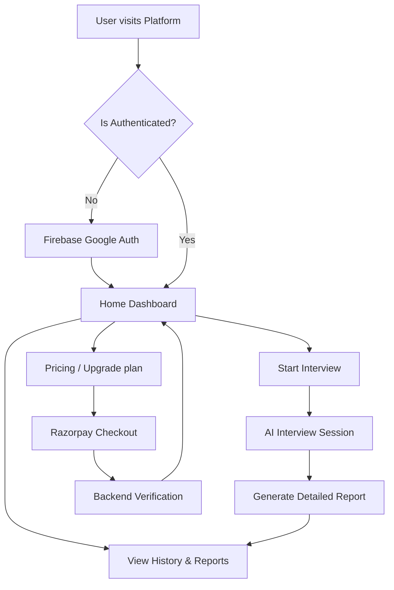
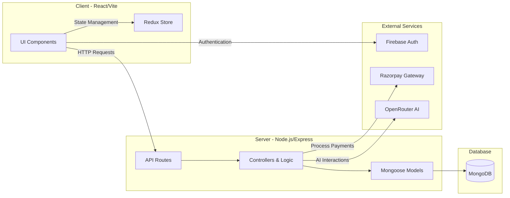

# InterviewAI

InterviewAI is a full-stack platform designed to help with interview preparation. It features AI-integrated analysis, payment gateways, and authentication to provide a seamless preparation experience.

This project is built using:
- **Frontend**: React, Vite, TailwindCSS, Redux Toolkit, Firebase
- **Backend**: Node.js, Express, MongoDB (Mongoose), Razorpay, OpenRouter API

## Prerequisites

Before you begin, ensure you have the following installed:
- [Node.js](https://nodejs.org/) (v16 or higher is recommended)
- [MongoDB](https://www.mongodb.com/) (Local instance or MongoDB Atlas)

You will also need accounts/keys for:
- Firebase (for frontend authentication)
- Razorpay (for payments)
- OpenRouter API (for AI capabilities)

---

## Getting Started

Follow these steps to set up the project locally.

### 1. Clone the repository
Navigate to the root directory of the project in your terminal.
```bash
cd AI-Mock-Interview-System
```

### 2. Set up Environment Variables

You need to create a `.env` file in both the `client` and `server` directories.

#### Client Environment Variables
Create `client/.env` and add the following keys:
```env
VITE_FIREBASE_APIKEY=your_firebase_api_key
VITE_RAZORPAY_KEY_ID=your_razorpay_key_id
```

#### Server Environment Variables
Create `server/.env` and add the following keys:
```env
PORT=8000
MONGODB_URL=your_mongodb_connection_string
JWT_SECRET=your_jwt_secret_key
OPENROUTER_API_KEY=your_openrouter_api_key
RAZORPAY_KEY_ID=your_razorpay_key_id
RAZORPAY_KEY_SECRET=your_razorpay_key_secret
```

### 3. Install Dependencies

You'll need to install the dependencies for both the frontend and backend.

**For the Backend (Server):**
```bash
cd server
npm install
```

**For the Frontend (Client):**
```bash
cd ../client
npm install
```

### 4. Run the Development Servers

You need to run both the frontend and backend servers concurrently. Open two separate terminal windows or tabs.

**Terminal 1: Start the Backend Server**
```bash
cd server
npm run dev
```
The server will start on `http://localhost:8000` (or the port specified in your `.env` file).

**Terminal 2: Start the Frontend Client**
```bash
cd client
npm run dev
```
The client will start up, usually accessible at `http://localhost:5173`.

---

## Detailed Workflow

Here's how a user typically interacts with the InterviewAI platform:

### User Journey Diagram




1. **Authentication:** 
   - A user lands on the Home page (`/`) and navigates to authenticate (`/auth`).
   - Authentication is handled seamlessly using **Firebase Google Auth** on the frontend.
   - Upon successful login, the backend issues a **JWT** for secure, authenticated requests across the platform.

2. **Conducting an Interview:**
   - The user proceeds to the Interview Page (`/interview`) to practice their skills.
   - The AI interacts using the **OpenRouter API** securely via backend services to analyze responses, pose questions, and provide interactive feedback.

3. **Premium Features & Payments:**
   - For advanced features or more credits, users can navigate to the Pricing page (`/pricing`).
   - The platform integrates **Razorpay** via the `/api/payment` backend route to process secure transactions.
   - Once payment is successful, the user's account constraints are updated in the MongoDB database.

4. **Reviewing Performance:**
   - Users can review past interviews at any time through the History Page (`/history`).
   - Detailed, AI-generated reports for specific interviews can be viewed at the Report Page (`/report/:id`).

---

## Detailed Project Structure

### System Architecture



### `/client` (Frontend Application)
Built with React, Vite, Redux Toolkit, and TailwindCSS.
- **`src/components/`**: Modular, reusable UI components.
- **`src/pages/`**: Main application views mapping to the router logic (e.g., `Home`, `Auth`, `InterviewPage`, `InterviewHistory`, `Pricing`, `InterviewReport`).
- **`src/redux/`**: Centralized application state management (e.g., managing the current user's profile and active session).
- **`src/utils/`**: Helper files like Firebase setup.

### `/server` (Backend Application)
Built with Node.js, Express, and MongoDB (via Mongoose).
- **`routes/`**: Express route definitions securely funneling requests to specific domains (`auth`, `user`, `interview`, `payment`).
- **`controllers/`**: Core logic for handling incoming requests and returning responses.
- **`models/`**: Mongoose schemas defining MongoDB collections.
- **`services/`**: Independent modules for external interactions, like the OpenRouter interactions.
- **`config/`**: Configuration instructions such as MongoDB database connection setups.
- **`middlewares/`**: Frequently used for verifying JWTs and authorization rules.
